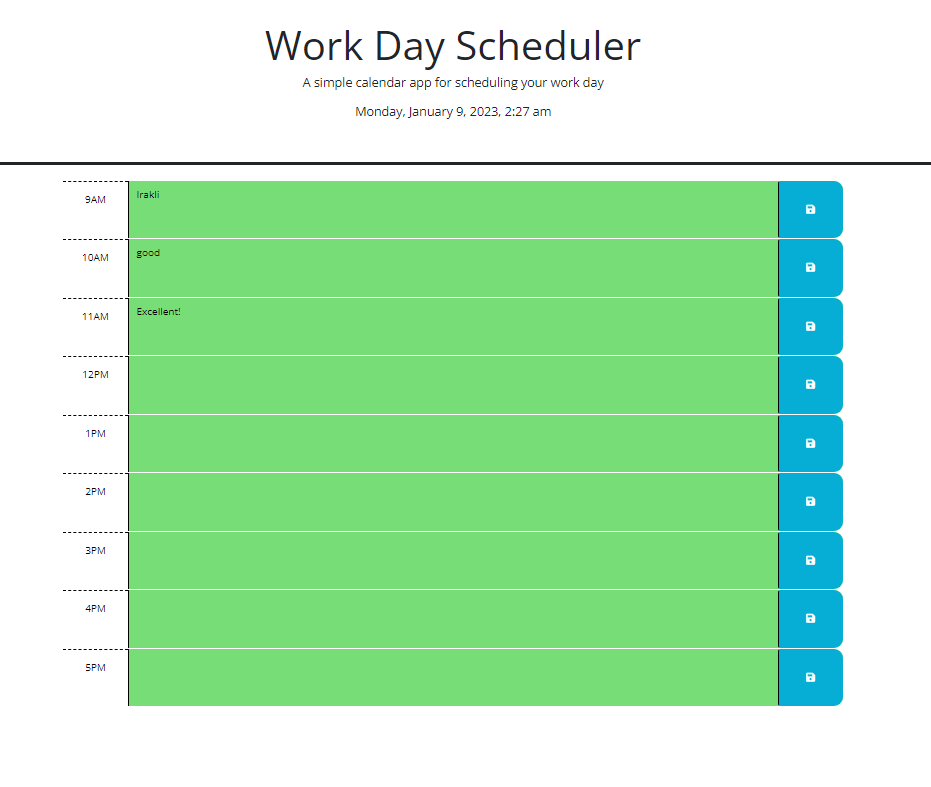

# Irakli-Work-Day-Scheduler-Mod5

## Description

AS AN employee with a busy schedule
I WANT to add important events to a daily planner
SO THAT I can manage my time effectively

<!-- 
Provide a short description explaining the what, why, and how of your project. Use the following questions as a guide:

- What was your motivation?
- Why did you build this project? (Note: the answer is not "Because it was a homework assignment.")
- What problem does it solve?
- What did you learn? -->

<!-- ## Table of Contents (Optional)

If your README is long, add a table of contents to make it easy for users to find what they need.

- [Installation](#installation)
- [Usage](#usage)
- [Credits](#credits)
- [License](#license) -->

<!-- ## #usage -->

<!-- ## Installation

What are the steps required to install your project? Provide a step-by-step description of how to get the development environment running. -->

## Usage

GIVEN I am using a daily planner to create a schedule:
  - WHEN I open the planner,
      THEN the current day is displayed at the top of the calendar;
  - WHEN I scroll down,
      THEN I am presented with timeblocks for standard business hours;
  - WHEN I view the timeblocks for that day,
      THEN each timeblock is color coded to indicate whether it is in the past, present, or future;
  - WHEN I click into a timeblock,
      THEN I can enter an event;
  - WHEN I click the save button for that timeblock,
      THEN the text for that event is saved in local storage;
  - WHEN I refresh the page,
      THEN the saved events persist.

<!-- Provide instructions and examples for use. Include screenshots as needed.

To add a screenshot, create an `assets/images` folder in your repository and upload your screenshot to it. Then, using the relative filepath, add it to your README using the following syntax: -->

## Mock-Up

Screenshot:
    


## Links to deployed application and GitHub Repo

https://ikaera.github.io/Irakli-Work-Day-Scheduler-Mod5/

https://github.com/ikaera/Irakli-Work-Day-Scheduler-Mod5

<!-- ## Credits

List your collaborators, if any, with links to their GitHub profiles.

If you used any third-party assets that require attribution, list the creators with links to their primary web presence in this section.

If you followed tutorials, include links to those here as well.

## License

The last section of a high-quality README file is the license. This lets other developers know what they can and cannot do with your project. If you need help choosing a license, refer to [https://choosealicense.com/](https://choosealicense.com/).

---

🏆 The previous sections are the bare minimum, and your project will ultimately determine the content of this document. You might also want to consider adding the following sections.

## Badges


Badges aren't necessary, per se, but they demonstrate street cred. Badges let other developers know that you know what you're doing. Check out the badges hosted by [shields.io](https://shields.io/). You may not understand what they all represent now, but you will in time.

## Features

If your project has a lot of features, list them here.

## How to Contribute

If you created an application or package and would like other developers to contribute it, you can include guidelines for how to do so. The [Contributor Covenant](https://www.contributor-covenant.org/) is an industry standard, but you can always write your own if you'd prefer.

## Tests

Go the extra mile and write tests for your application. Then provide examples on how to run them here. -->

<!-- 
-------------------------
# 05 Third-Party APIs: Work Day Scheduler

## Your Task

Create a simple calendar application that allows a user to save events for each hour of the day by modifying starter code. This app will run in the browser and feature dynamically updated HTML and CSS powered by jQuery.

You'll need to use the [Day.js](https://day.js.org/en/) library to work with date and time. Be sure to read the documentation carefully and concentrate on using Day.js in the browser.

## User Story

```md
AS AN employee with a busy schedule
I WANT to add important events to a daily planner
SO THAT I can manage my time effectively
```

## Acceptance Criteria

```md
GIVEN I am using a daily planner to create a schedule
WHEN I open the planner
THEN the current day is displayed at the top of the calendar
WHEN I scroll down
THEN I am presented with timeblocks for standard business hours
WHEN I view the timeblocks for that day
THEN each timeblock is color coded to indicate whether it is in the past, present, or future
WHEN I click into a timeblock
THEN I can enter an event
WHEN I click the save button for that timeblock
THEN the text for that event is saved in local storage
WHEN I refresh the page
THEN the saved events persist
```

The following animation demonstrates the application functionality:

<!-- @TODO: create ticket to review/update image) -->
<!-- 

## Grading Requirements

> **Note**: If a Challenge assignment submission is marked as “0”, it is considered incomplete and will not count towards your graduation requirements. Examples of incomplete submissions include the following:
>
> * A repository that has no code
>
> * A repository that includes a unique name but nothing else
>
> * A repository that includes only a README file but nothing else
>
> * A repository that only includes starter code

This Challenge is graded based on the following criteria:

### Technical Acceptance Criteria: 40%

* Satisfies all of the above acceptance criteria plus the following:

  * Uses a date utility library to work with date and time

### Deployment: 32%

* Application deployed at live URL

* Application loads with no errors

* Application GitHub URL submitted

* GitHub repo contains application code

### Application Quality: 15%

* Application user experience is intuitive and easy to navigate

* Application user interface style is clean and polished

* Application resembles the mock-up functionality provided in the Challenge instructions

### Repository Quality: 13%

* Repository has a unique name

* Repository follows best practices for file structure and naming conventions

* Repository follows best practices for class/id naming conventions, indentation, quality comments, etc.

* Repository contains multiple descriptive commit messages

* Repository contains quality README file with description, screenshot, and link to deployed application

## Review

You are required to submit the following for review:

* The URL of the deployed application

* The URL of the GitHub repository, with a unique name and a README describing the project

- - -
© 2022 edX Boot Camps LLC. Confidential and Proprietary. All Rights Reserved. --> -->
